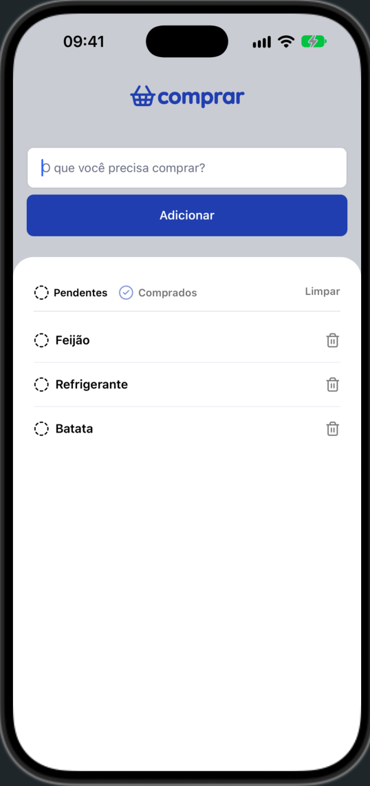
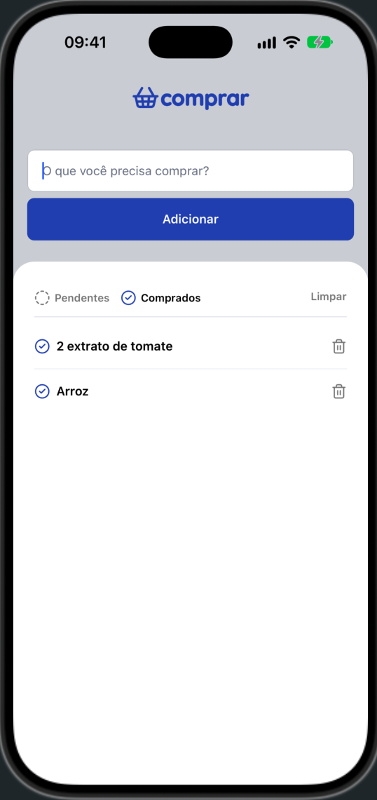
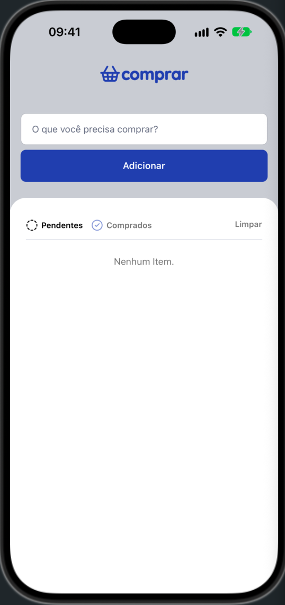

# Comprar — Shopping List App

A shopping list mobile app built with React Native and Expo. Add items, mark them as bought, filter by status and keep everything saved on the device.

<p align="center">
  
  
  
</p>

## Features

- Add items to the shopping list
- Mark items as bought or pending
- Filter the list by status
- Remove a single item or clear the whole list
- Data persists locally between app sessions
- Runs on iOS, Android and web

## Tech Stack

- [React Native](https://reactnative.dev/) 0.86 + [Expo](https://expo.dev/) SDK 57
- TypeScript (strict mode)
- [AsyncStorage](https://react-native-async-storage.github.io/async-storage/) for local persistence
- [react-native-safe-area-context](https://docs.expo.dev/versions/latest/sdk/safe-area-context/) for notch and status bar handling
- [Lucide](https://lucide.dev/) icons

## Key Concepts

- **Reusable components** with typed props that extend native component props (`TouchableOpacityProps`, `TextInputProps`)
- **Storage layer** isolated from the UI (`src/storage`), so screens never talk to AsyncStorage directly
- **State and side effects** with `useState` and `useEffect` to reload the list whenever the filter changes
- **Performant lists** with `FlatList`, including empty state and item separators
- **Centralized theme** colors in `src/theme`
- **Accessibility**: labels, roles and larger touch areas on icon buttons
- **Platform-specific code** with `Platform.OS` (browser confirm dialog on web)

## Project Structure

```
src/
├── app/Home/        # Home screen
├── components/      # Button, Input, Filter, Item, StatusIcon
├── storage/         # AsyncStorage data access
├── theme/           # Color tokens
├── types/           # Shared types and enums
└── App.tsx          # Root component (providers + status bar)
```

## Getting Started

**Prerequisites:** Node.js (LTS) and the [Expo Go](https://expo.dev/go) app on your phone (or an iOS/Android emulator).

```bash
git clone git@github.com:wesley-rfa/app-comprar.git
cd app-comprar
npm install
npx expo start
```

Scan the QR code with Expo Go, or press `i` (iOS), `a` (Android) or `w` (web).

## Design

UI based on the [Comprar Figma file](https://www.figma.com/community/file/1479824702066313496/comprar-app).

## Credits

Built while following the React Native track at [Rocketseat](https://www.rocketseat.com.br/), with my own improvements to the code.

## License

This project is licensed under the MIT License. See [LICENSE](LICENSE) for details.
